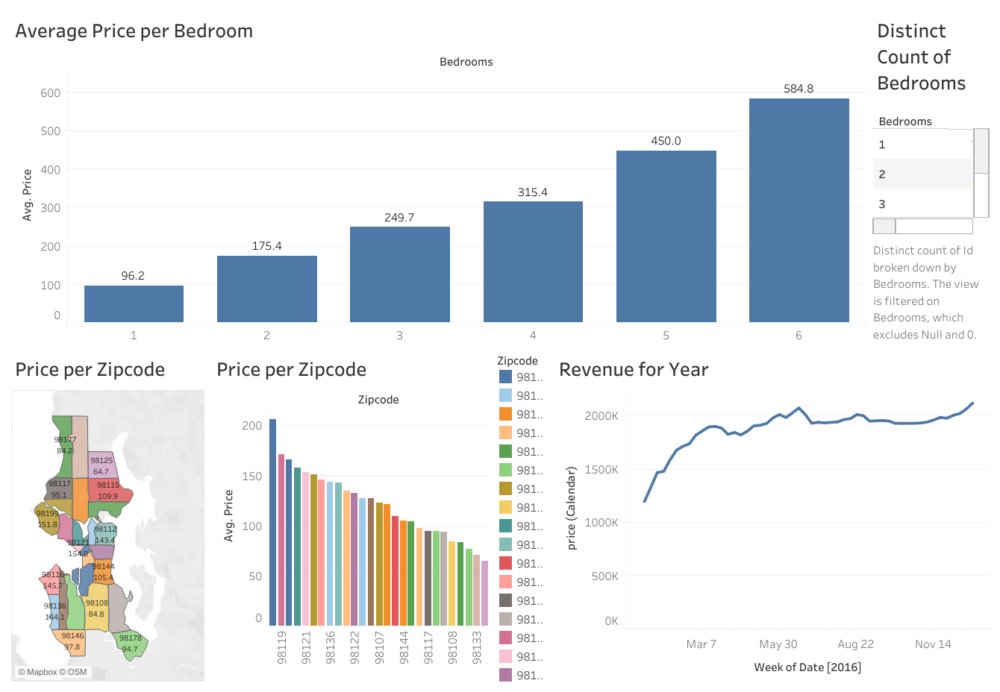

# AirBnB Data Analysis Project 📊

## 🔗 Live Demo
👉 **[View the Interactive Dashboard on Tableau Public](https://public.tableau.com/views/AirBnBFullProject_17660734498260/Dashboard1?:language=en-US&:sid=&:redirect=auth&:display_count=n&:origin=viz_share_link)**

## 📌 Project Overview

This dashboard allows users to explore AirBnB data to answer key business questions regarding property pricing and host revenue. The project visualizes correlations between location (Zipcode), property features (number of bedrooms), and financial performance over time.

### Key Visualizations Included:
* **Price per Zipcode:** A dual visualization (Map & Bar Chart) identifying the most expensive and affordable neighborhoods based on average listing price.
* **Revenue for Year:** A time-series analysis tracking total revenue trends throughout the year 2016.
* **Average Price per Bedroom:** An analysis of how the number of bedrooms impacts the average listing price.
* **Distinct Count of Bedrooms:** A breakdown of the inventory available by bedroom count.

## 📂 Data Source
This project uses the **Airbnb Listings 2016 Dataset**.
* **Source:** [Inside Airbnb](http://insideairbnb.com/get-the-data/) / [Kaggle](https://www.kaggle.com/datasets/alexanderfreberg/airbnb-listings-2016-dataset)
* **Dataset Description:** The dataset contains listing activity and metrics for Airbnb rentals in 2016.

## 🔧 Technologies Used
* **Tableau Desktop** (Version 2025.3)
* **Tableau Public** (Hosting)
* **Data Source:** Excel Data (`Tableau Full Project.xlsx`)

## 🚀 How to Run this Project

**Option 1: View Online (Recommended)**
Click the [Live Demo link](https://public.tableau.com/views/AirBnBFullProject_17660734498260/Dashboard1?:language=en-US&:sid=&:redirect=auth&:display_count=n&:origin=viz_share_link) to interact with the dashboard in your browser. No installation is required.

**Option 2: Run Locally**
1.  Clone this repository.
2.  Ensure you have **Tableau Desktop** installed.
3.  Open the `.twbx` file (Tableau Packaged Workbook) to view the source data and calculations.

## 📂 Project Structure
* `AirBnB_Full_Project.twbx` - The packaged workbook containing data and visualizations.
* `Dashboard.png` - Preview image of the dashboard.
* `README.md` - Project documentation.

---
*Author: Rumman*
